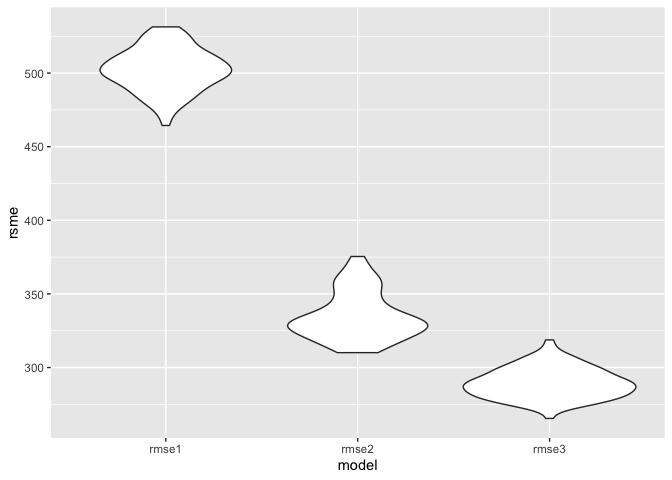

Homework 6
================
Amanda Warnock

This is my solution to HW6.

``` r
library(tidyverse)
```

    ## ── Attaching packages ─────────────────────────────────────────────── tidyverse 1.3.0 ──

    ## ✓ ggplot2 3.3.2     ✓ purrr   0.3.4
    ## ✓ tibble  3.0.3     ✓ dplyr   1.0.2
    ## ✓ tidyr   1.1.2     ✓ stringr 1.4.0
    ## ✓ readr   1.3.1     ✓ forcats 0.5.0

    ## ── Conflicts ────────────────────────────────────────────────── tidyverse_conflicts() ──
    ## x dplyr::filter() masks stats::filter()
    ## x dplyr::lag()    masks stats::lag()

``` r
library(modelr)
library(mgcv)
```

    ## Loading required package: nlme

    ## 
    ## Attaching package: 'nlme'

    ## The following object is masked from 'package:dplyr':
    ## 
    ##     collapse

    ## This is mgcv 1.8-33. For overview type 'help("mgcv-package")'.

## Problem 1

``` r
homicide_df = 
  read_csv("data/homicide-data.csv", na = c("", "NA", "Unknown")) %>% 
  mutate(
    city_state = str_c(city, state, sep = ", "),
    victim_age = as.numeric(victim_age),
    resolution = case_when(
      disposition == "Closed without arrest" ~ 0,
      disposition == "Open/No arrest" ~0,
      disposition == "Closed by arrest" ~ 1)
    ) %>% 
  filter(
    city_state !="Tulsa, AL",
    victim_race %in% c("White", "Black")) %>% 
  select(city_state, resolution, victim_age, victim_race, victim_sex)
```

    ## Parsed with column specification:
    ## cols(
    ##   uid = col_character(),
    ##   reported_date = col_double(),
    ##   victim_last = col_character(),
    ##   victim_first = col_character(),
    ##   victim_race = col_character(),
    ##   victim_age = col_double(),
    ##   victim_sex = col_character(),
    ##   city = col_character(),
    ##   state = col_character(),
    ##   lat = col_double(),
    ##   lon = col_double(),
    ##   disposition = col_character()
    ## )

``` r
baltimore_df = 
  homicide_df %>% 
  filter(city_state == "Baltimore, MD")

glm(resolution ~ victim_age + victim_race + victim_sex,
    data = baltimore_df,
    family = binomial()) %>% 
  broom::tidy() %>% 
  mutate(
    OR = exp(estimate),
    CI_lower = exp(estimate - 1.96 * std.error),
    CI_upper = exp(estimate + 1.96 * std.error)
  ) %>% 
  select(term, OR, starts_with("CI")) %>% 
  knitr::kable(digits=3)
```

| term              |    OR | CI\_lower | CI\_upper |
| :---------------- | ----: | --------: | --------: |
| (Intercept)       | 1.363 |     0.975 |     1.907 |
| victim\_age       | 0.993 |     0.987 |     1.000 |
| victim\_raceWhite | 2.320 |     1.648 |     3.268 |
| victim\_sexMale   | 0.426 |     0.325 |     0.558 |

^remember that you need to exponentiate the estimates to be able to
compare them to 1

try across cities

``` r
model_results_df = 
homicide_df %>% 
  nest(data = -city_state) %>% 
  mutate(
    models = map(.x = data, ~glm(resolution ~ victim_age + victim_race + victim_sex, data = .x,
    family = binomial())),
    results = map(models, broom::tidy)
  ) %>% 
  select(city_state, results) %>% 
  unnest(results) %>% 
  mutate(
    OR = exp(estimate),
    CI_lower = exp(estimate - 1.96 * std.error),
    CI_upper = exp(estimate + 1.96 * std.error)
  ) %>% 
  select(city_state, term, OR, starts_with("CI"))
```

``` r
model_results_df %>% 
  filter(term == "victim_sexMale") %>% 
  mutate(city_state = fct_reorder(city_state, OR)) %>% 
  ggplot(aes(x = city_state, y = OR)) +
  geom_point() +
  geom_errorbar(aes(ymin = CI_lower, ymax = CI_upper)) +
theme(axis.text.x = element_text(angle = 90))
```

<!-- -->

## Problem 2

Loading data.

``` r
bw_df =
  read.csv("data/birthweight.csv") %>% 
  janitor::clean_names()
```

Cleaning data.

``` r
bw_df = 
bw_df %>% 
  mutate(
    babysex = as.character(babysex),
    babysex = case_when(
      babysex == 1 ~ "Male",
      babysex == 2 ~ "Female"),
    frace = as.character(frace),
    frace = case_when(
      frace == 1 ~ "White",
      frace == 2 ~ "Black",
      frace == 3 ~ "Asian",
      frace == 4 ~ "Puerto Rican",
      frace == 8 ~ "Other",
      frace == 9 ~ "Unknown"),
    gaweeks = as.double(gaweeks),
    malform = as.character(malform),
    malform = case_when(
      malform == 0 ~ "absent",
      malform == 1 ~ "present"),
    mrace = as.character(mrace),
    mrace = case_when(
      mrace == 1 ~ "White",
      mrace == 2 ~ "Black",
      mrace == 3 ~ "Asian",
      mrace == 4 ~ "Puerto Rican",
      mrace == 8 ~ "Other"),
    ppbmi = as.double(ppbmi),
    smoken = as.double(smoken)
    )
```

Income, smoking, and the age of the mother have all been found to be
associated with birthweight. Generally, it can be hypothesized that have
a lower income, more cigarettes per day, and an older age may result in
lower birthweight. I’m curious to look into these factors to see how
much of an impact they appear to have on birthweight.

Here, I set up the linear regression and clean the output.

``` r
fit = lm(bwt ~ fincome + smoken + momage, data = bw_df)
summary(fit)
```

    ## 
    ## Call:
    ## lm(formula = bwt ~ fincome + smoken + momage, data = bw_df)
    ## 
    ## Residuals:
    ##      Min       1Q   Median       3Q      Max 
    ## -2629.39  -283.21    13.56   324.63  1703.73 
    ## 
    ## Coefficients:
    ##              Estimate Std. Error t value Pr(>|t|)    
    ## (Intercept) 2757.8403    40.6064  67.916  < 2e-16 ***
    ## fincome        2.5471     0.3103   8.208 2.93e-16 ***
    ## smoken        -6.4523     1.0327  -6.248 4.56e-10 ***
    ## momage        13.3487     2.0782   6.423 1.48e-10 ***
    ## ---
    ## Signif. codes:  0 '***' 0.001 '**' 0.01 '*' 0.05 '.' 0.1 ' ' 1
    ## 
    ## Residual standard error: 501.8 on 4338 degrees of freedom
    ## Multiple R-squared:  0.04075,    Adjusted R-squared:  0.04009 
    ## F-statistic: 61.43 on 3 and 4338 DF,  p-value: < 2.2e-16

``` r
fit_table = 
fit %>% 
  broom::tidy() %>% 
  select(term, estimate, p.value) %>% 
  mutate(
    term = str_replace(term, "^fincome", "Family monthly income in hundreds"),
    term = str_replace(term, "^smoken", "Av. cigarettes per day during pregnancy"),
    term = str_replace (term, "^momage", "Age of mom at delivery")) %>% 
  knitr::kable()

fit_table
```

| term                                    |    estimate | p.value |
| :-------------------------------------- | ----------: | ------: |
| (Intercept)                             | 2757.840337 |       0 |
| Family monthly income in hundreds       |    2.547146 |       0 |
| Av. cigarettes per day during pregnancy |  \-6.452334 |       0 |
| Age of mom at delivery                  |   13.348684 |       0 |

Exploratory analysis.

``` r
fincome_resid = 
bw_df %>% 
  modelr::add_residuals(fit) %>% 
  ggplot(aes(x =  fincome, y = resid)) + geom_violin()

fincome_pred = 
  bw_df %>% 
  modelr::add_predictions(fit) %>% 
  ggplot(aes(x = fincome, y  = pred)) + geom_violin()
```

``` r
smoken_resid = 
bw_df %>% 
  modelr::add_residuals(fit) %>% 
  ggplot(aes(x = smoken, y = resid)) + geom_violin()

smoken_pred = 
  bw_df %>% 
  modelr::add_predictions(fit) %>% 
  ggplot(aes(x = smoken, y = pred)) + geom_violin()
```

``` r
momage_resid = 
  bw_df %>% 
  modelr::add_residuals(fit) %>% 
  ggplot(aes(x = momage, y = resid)) + geom_violin()

momage_pred = 
  bw_df %>% 
  modelr::add_predictions(fit) %>% 
  ggplot(aes(x = momage, y = pred)) + geom_violin()
```

Plot of residuals.

``` r
resid_pred = 
bw_df %>% 
  modelr::add_residuals(fit) %>% 
  modelr::add_predictions(fit)  %>% 
  ggplot(aes(x = resid, y = pred)) + geom_point()

resid_pred
```

<!-- -->

Residuals tend to cluster around 0 and predictions tend to cluster
around 3100.

Compare to other models.

``` r
fit2 = lm(bwt ~ blength + gaweeks, data = bw_df)
summary(fit2)
```

    ## 
    ## Call:
    ## lm(formula = bwt ~ blength + gaweeks, data = bw_df)
    ## 
    ## Residuals:
    ##     Min      1Q  Median      3Q     Max 
    ## -1709.6  -215.4   -11.4   208.2  4188.8 
    ## 
    ## Coefficients:
    ##              Estimate Std. Error t value Pr(>|t|)    
    ## (Intercept) -4347.667     97.958  -44.38   <2e-16 ***
    ## blength       128.556      1.990   64.60   <2e-16 ***
    ## gaweeks        27.047      1.718   15.74   <2e-16 ***
    ## ---
    ## Signif. codes:  0 '***' 0.001 '**' 0.01 '*' 0.05 '.' 0.1 ' ' 1
    ## 
    ## Residual standard error: 333.2 on 4339 degrees of freedom
    ## Multiple R-squared:  0.5769, Adjusted R-squared:  0.5767 
    ## F-statistic:  2958 on 2 and 4339 DF,  p-value: < 2.2e-16

``` r
fit2_resid_pred = 
  bw_df %>% 
  modelr::add_residuals(fit2) %>% 
  modelr::add_predictions(fit2) %>% 
  ggplot(aes(x = resid, y = pred)) + geom_point()

fit2_resid_pred
```

<!-- -->

While these resdiuals also cluster around 0 and the predictions cluster
around 3000, there are some major outliers.

``` r
fit3 = lm(bwt ~ bhead + blength + babysex, data = bw_df)
summary(fit3)
```

    ## 
    ## Call:
    ## lm(formula = bwt ~ bhead + blength + babysex, data = bw_df)
    ## 
    ## Residuals:
    ##      Min       1Q   Median       3Q      Max 
    ## -1138.45  -190.36   -11.59   177.64  2693.95 
    ## 
    ## Coefficients:
    ##              Estimate Std. Error t value Pr(>|t|)    
    ## (Intercept) -6080.305     96.224 -63.189  < 2e-16 ***
    ## bhead         148.175      3.512  42.192  < 2e-16 ***
    ## blength        85.016      2.071  41.044  < 2e-16 ***
    ## babysexMale   -41.086      8.887  -4.623 3.89e-06 ***
    ## ---
    ## Signif. codes:  0 '***' 0.001 '**' 0.01 '*' 0.05 '.' 0.1 ' ' 1
    ## 
    ## Residual standard error: 288.5 on 4338 degrees of freedom
    ## Multiple R-squared:  0.6829, Adjusted R-squared:  0.6827 
    ## F-statistic:  3114 on 3 and 4338 DF,  p-value: < 2.2e-16

``` r
fit3_resid_pred = 
  bw_df  %>% 
  modelr::add_residuals(fit3) %>% 
  modelr::add_predictions(fit3) %>% 
  ggplot(aes(x = resid, y = pred)) + geom_point()

fit3_resid_pred
```

<!-- -->

Overall clustering is similar, but there are also multiple major
outliers.

Comparing via cross-validation.

``` r
cv_df = 
crossv_mc(bw_df, 100) %>% 
  mutate(
    train  = map(train, as_tibble),
    test = map(test, as_tibble))
```

``` r
cv_df =  
  cv_df %>% 
  mutate(
    fit1  = map(train, ~lm(bwt ~ fincome + smoken + momage, data = .x)),
    fit2 =  map(train, ~lm(bwt ~ blength + gaweeks, data = .x)),
    fit3 = map(train, ~lm(bwt ~ bhead + blength + babysex, data = .x))) %>% 
  mutate(
    rmse1 = map2_dbl(fit1, test, ~rmse(model  = .x,  data = .y)), 
    rmse2 =  map2_dbl(fit2, test, ~rmse(model = .x, data = .y)),
    rmse3 = map2_dbl(fit3, test, ~rmse(model =  .x, data = .y))
  )

cv_df
```

    ## # A tibble: 100 x 9
    ##    train             test             .id   fit1   fit2  fit3  rmse1 rmse2 rmse3
    ##    <list>            <list>           <chr> <list> <lis> <lis> <dbl> <dbl> <dbl>
    ##  1 <tibble [3,473 ×… <tibble [869 × … 001   <lm>   <lm>  <lm>   499.  332.  282.
    ##  2 <tibble [3,473 ×… <tibble [869 × … 002   <lm>   <lm>  <lm>   502.  329.  280.
    ##  3 <tibble [3,473 ×… <tibble [869 × … 003   <lm>   <lm>  <lm>   511.  349.  299.
    ##  4 <tibble [3,473 ×… <tibble [869 × … 004   <lm>   <lm>  <lm>   482.  323.  280.
    ##  5 <tibble [3,473 ×… <tibble [869 × … 005   <lm>   <lm>  <lm>   488.  317.  271.
    ##  6 <tibble [3,473 ×… <tibble [869 × … 006   <lm>   <lm>  <lm>   497.  341.  295.
    ##  7 <tibble [3,473 ×… <tibble [869 × … 007   <lm>   <lm>  <lm>   496.  320.  267.
    ##  8 <tibble [3,473 ×… <tibble [869 × … 008   <lm>   <lm>  <lm>   504.  328.  285.
    ##  9 <tibble [3,473 ×… <tibble [869 × … 009   <lm>   <lm>  <lm>   510.  324.  295.
    ## 10 <tibble [3,473 ×… <tibble [869 × … 010   <lm>   <lm>  <lm>   498.  333.  290.
    ## # … with 90 more rows

``` r
cv_comparison = 
cv_df %>% 
  select(starts_with("rmse")) %>% 
  pivot_longer(
    everything(),
    names_to  = "model",
    values_to  = "rsme",
    names_prefix =  "rsme_") %>% 
  ggplot(aes(x = model, y  = rsme)) + geom_violin()

cv_comparison
```

<!-- -->

The RSME for my model, RMSE1, are far higher than for the other two
models. The model using head circumference, length, and sex has the
lowest RSME.
